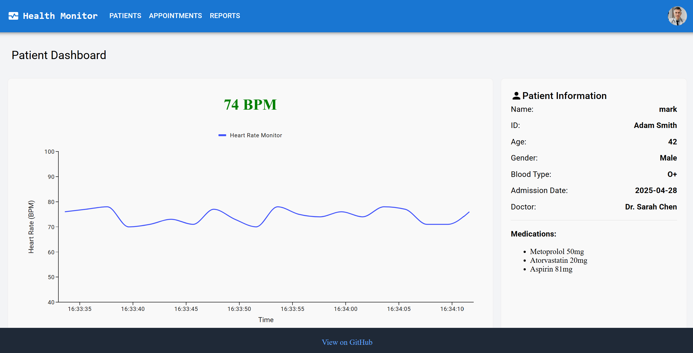

# 🩺 Health Monitor – Real-Time Patient Dashboard

A real-time patient monitoring dashboard that displays heart rate using a .NET backend and a React frontend. This project mimics the kind of work done in hospital systems like Philips' PIIC iX — providing scalable, connected, on-prem health monitoring software.

> ⚡ **Live Demo**
- 🌐 **Frontend (React + Netlify):** [https://healthpatientmonitor.netlify.app/](https://healthpatientmonitor.netlify.app/)
- 🛠️ **Backend (.NET API + Railway):** [https://patient-monitoring-app-production.up.railway.app/](https://patient-monitoring-app-production.up.railway.app/)

---

## 📸 Preview

---

## 🚀 Features

- 🔄 Real-time heart rate monitoring using **polling**
- 📈 Live heart rate graph with historical trends
- 👤 Dynamic patient information panel (name, age, ID, doctor, medications)
- 📦 Lightweight .NET API simulating patient data
- 🌐 Fully deployed frontend and backend for easy access

---

## 🧰 Technologies Used

### Frontend
- **React** (with hooks)
- **mui charts** for data visualization
- **Netlify** for deployment
- **CSS Modules / mui** 

### Backend
- **.NET Core Web API**
- Randomized BPM data simulation
- **CORS enabled** for cross-origin access
- **Deployed via Railway**

